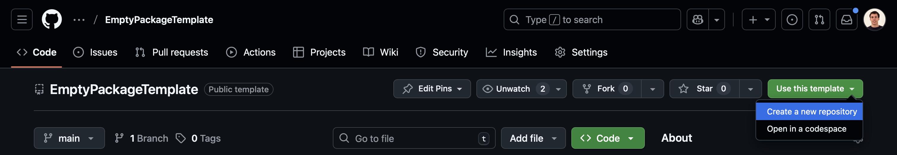

# EmptyPackageTemplate

This template empty package is meant to be used to create new R packages.

## Instructions

Create a new repository using:

*Use this template* \> *Create a new repository* \> Choose the name of your rep and click *Create repository*

> Note that once created some actions will be triggered to change the name of your package from 'EmptyPackage' to the name of the repository that you created.

> Note you will need to create a **public** repository so actions work properly as expected.

## Content

The package contain:

-   [R](./R) single `hello()` function.
-   [tests](./tests) framework to test via testthat and a simple test for the `hello()` function.
-   [.github](./.github) the github actions that contain: automatic checks, deployment of package website.
-   [_pkgdown.yml](./_pkgdown.yml) to edit the package website.
-   [extras](./extras) some useful scripts to maintain the package.

## Book

This template has been built as part of the book: [**Tidy R packages with the OMOP CDM**](https://oxford-pharmacoepi.github.io/Tidy-R-packages-with-OMOP/).
